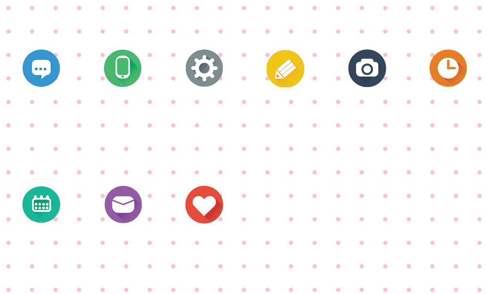
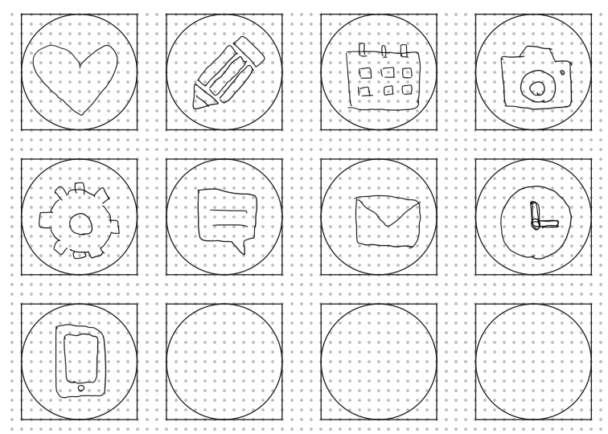
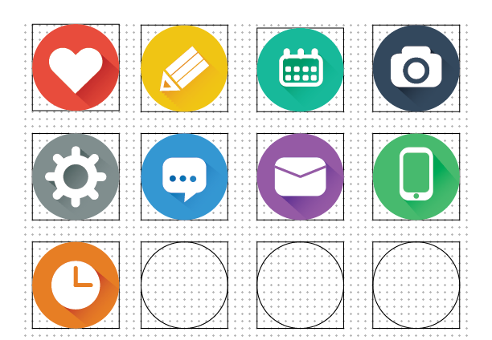

# Click-N-Drag-Icons

This web emulates the layout of icons on a smart phone home screen and is responsive on different sized displays with a pure CSS pink polka dots wallpaper background. 
You can start dragging any icon by clicking and holding it for a second. 
Dropping a icon into other icons will re-order the icons on the screen.

## Design Customized Icons:
I have also created some flat design icons for high resolution display with Adobe Illustrator.

sketches                   |  Illustrator
:-------------------------:|:-------------------------:
  |  

